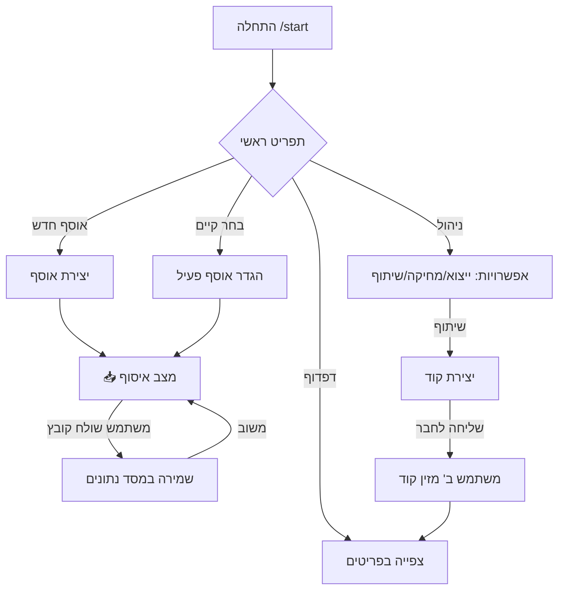

<div align="center">

# 📁 בוט אוספים לטלגרם


**בוט טלגרם מתקדם המאפשר לך לשמור, לארגן, לדפדף, ולשתף אוספים של מדיה וטקסט.**

[🇮🇱 עברית](README-he.md) • [🇺🇸 English](README.md)

</div>

---

## ✨ תכונות עיקריות

| פיצ'ר | תיאור |
|---------|-------------|
| 📦 **ניהול אוספים** | יצירה וניהול של מספר בלתי מוגבל של אוספים |
| ☁️ **שמירת מדיה** | תמיכה בתמונות, סרטונים, מסמכים, אודיו וטקסט |
| 🔍 **סורק כפולים** | זיהוי והסרת קבצים כפולים באוסף עם זיהוי חכם |
| 🔗 **שיתוף מאובטח** | שיתוף אוספים באמצעות קודים ייחודיים ומעקב |
| 📊 **מידע על אוסף** | תצוגת סטטיסטיקות מפורטות: ספירה לפי סוג, גדלים, תאריכים |
| 📈 **סטטוס בזמן אמת** | עדכון חי על התקדמות העלאת קבצים מרובה |
| 🛡️ **ממשק ניהול** | דשבורד מלא לניהול משתמשים וסטטיסטיקות |
| 📝 **כיתוב אוטומטי** | שמירת כיתוב (Caption) יחד עם הקבצים |
| 👁️ **דפדוף נוח** | ממשק דפדוף בתוך הבוט לצפייה בתוכן ותצוגת גלילה |
| 🎲 **פריט אקראי** | קפיצה לפריט אקראי באוסף בלחיצת כפתור אחת |
| ⚡ **ביצועים** | תכנות אסינכרוני עם הגנה מהצפות (Anti-Flood) |

---

## 🚀 התקנה

### 1️⃣ שכפול הפרויקט
```bash
git clone https://github.com/Omer-Dahan/Collections-bot
cd Collections-bot
```

### 2️⃣ יצירת סביבה וירטואלית
```bash
# Windows
python -m venv venv
venv\Scripts\activate

# Linux/macOS
python3 -m venv venv
source venv/bin/activate
```

### 3️⃣ התקנת תלויות
```bash
pip install -r requirements.txt
```

### 4️⃣ הגדרות
יש ליצור קובץ `config.py` לפי הדוגמה הבאה:
```python
BOT_TOKEN = "your_bot_token_here"
ADMIN_IDS = [123456789]  # רשימת ה-ID של המנהלים

# הגדרות אופציונליות
MAX_CAPTION_LENGTH = 800
```

### 5️⃣ הרצת הבוט
```bash
python bot.py
```

---

## 🤖 שימוש

השימוש בבוט הוא פשוט ואינטואיטיבי. הנה זרימת העבודה הבסיסית:

1.  **התחלה**: שלח `/start` כדי לפתוח את התפריט הראשי.
2.  **יצירת אוסף**: בחר ב-"📁 אוסף חדש", תן לו שם, והוא יהפוך ל-"פעיל".
3.  **שמירת תכנים**: כל הודעה שתשלח לבוט (תמונה, סרטון, קובץ, טקסט) תישמר אוטומטית באוסף הפעיל.
4.  **ניהול ודפדוף**: השתמש בתפריטים כדי לדפדף, למחוק או לשתף. בתצוגת פריט יחיד, תוכל להשתמש בכפתור ה-`🎲` כדי לקפוץ לפריט אקראי באוסף.
5.  **מידע על האוסף**: בתפריט ניהול האוסף, לחץ על `📊 מידע על האוסף` כדי לראות סטטיסטיקות מלאות: מספר סרטונים/תמונות/קבצים, גודל לפי סוג, גודל כולל ותאריכי הוספה.

### 🎮 פקודות זמינות

| פקודה | תיאור |
|:---|:---|
| `/start` | 🏠 חזרה לתפריט הראשי והצגת הסטטוס הנוכחי |
| `/new_collection` | 🆕 יצירת אוסף חדש במהירות (דוגמה: `/new_collection MyTops`) |
| `/list_collections` | 📋 הצגת רשימת האוספים שלך ובחירת אוסף פעיל |
| `/browse` | 📂 דפדוף בקבצים השמורים באוספים שלך |
| `/manage_collections` | ⚙️ תפריט ניהול מתקדם (מחיקה, ייצוא, שיתוף) |
| `/remove` | 🗑️ הפעלת מצב מחיקת פריטים בודדים |
| `/id_file` | 🆔 קבלת ה-File ID של קובץ (כלי עזר למפתחים) |
| `/access` | 🔑 גישה לאוסף משותף באמצעות קוד (דוגמה: `/access CODE123`) |

### 🔄 תרשים זרימה



---

## 🧱 מבנה הפרויקט


```
Collections-bot/
├── 📄 bot.py               # 🧠 הקובץ הראשי
├── 📄 admin_panel.py       # 🛡️ פאנל ניהול
├── 📄 db.py                # 🗄️ מסד נתונים
├── 📄 utils.py             # 🛠️ פונקציות עזר
├── 📄 config.py            # ⚙️ הגדרות (רגיש)
├── 📂 handlers/            # 🎮 לוגיקת הבוט
│   ├── 📄 commands.py      # פקודות מערכת
│   ├── 📄 callbacks.py     # טיפול בכפתורים
│   ├── 📄 messages.py      # טיפול במדיה והודעות
│   ├── 📄 browse_handlers.py # לוגיקת דפדוף
│   └── 📄 duplicate_handlers.py # לוגיקת סורק כפולים
├── 📄 constants.py         # 📝 קבועים
├── 📄 message_tracker.py   # 📨 מעקב הודעות
├── 📄 requirements.txt     # 📦 תלויות
├── 📄 run_bot.bat          # 🚀 מריץ לווינדוס
├── 📄 LICENSE.txt          # 📜 GPL-3.0
└── 📄 README.md            # כאן אתם נמצאים! 👋
```


---

## 🗄️ מסד הנתונים

הבוט משתמש ב-**SQLite** לשמירה יעילה ומהירה של הנתונים.
הטבלאות נוצרות אוטומטית בהפעלה הראשונה:

- **Collections**: טבלת האוספים של המשתמשים
- **Items**: פריטי מדיה המקושרים לאוספים
- **Users**: פרופילי משתמשים ומידע כללי
- **Shared_Collections**: קודי שיתוף פעילים והרשאות
- **Access_Logs**: לוג גישות לאוספים משותפים

---

## 🛡️ אבטחה ופרטיות

- 🔒 **פרטי כברירת מחדל**: כל האוספים פרטיים אלא אם שותפו ידנית.
- 🔑 **קודים ייחודיים**: השיתוף מתבצע ע"י קודים אקראיים וייחודיים.
- 🚫 **בקרת גישה**: בעל האוסף יכול לבטל קודי שיתוף בכל רגע.
- 📝 **לוגים**: תיעוד מלא של פעולות ושגיאות לניטור מהיר.

---

## ⚠️ הערות חשובות

> [!IMPORTANT]
> **מגבלות טלגרם**: העלאת קבצים כפופה למגבלות הגודל של טלגרם (עד 2GB לקובץ, או 4GB למנויי Premium).

> [!WARNING]
> **פרטיות הנתונים**: מסד הנתונים (`bot_data.db`) נשמר לוקאלית על השרת/מחשב המריץ את הבוט. מחיקת קובץ זה תוביל לאובדן כל המידע על האוספים! מומלץ לגבות אותו תקופתית.

> [!TIP]
> **יעילות**: הבוט שומר רק את ה-`File ID` של הקבצים ולא את הקבצים עצמם, מה שחוסך מקום אחסון רב בשרת ומאפשר פעולה מהירה מאוד.

> [!NOTE]
> **מחיקה**: מחיקת הודעה מהבוט בצ'אט לא מוחקת אותה ממסד הנתונים של הבוט. יש להשתמש בכלי המחיקה המובנים בבוט כדי להסיר פריטים לצמיתות מהאוסף.

---

## 📜 רישיון
פרויקט זה מורשה תחת **GNU General Public License v3.0**.

כל הפצה מחדש או שינוי חייבים לעמוד בתנאי רישיון זה.

---

## ⚠️ הבהרה משפטית
בוט זה נועד לשימוש חוקי בלבד.
האחריות על התוכן והעמידה בחוקים המקומיים ובמדיניות הפלטפורמה חלה על המשתמש בלבד.

---

<div align="center">

**Made with ❤️ by Omer**

</div>
