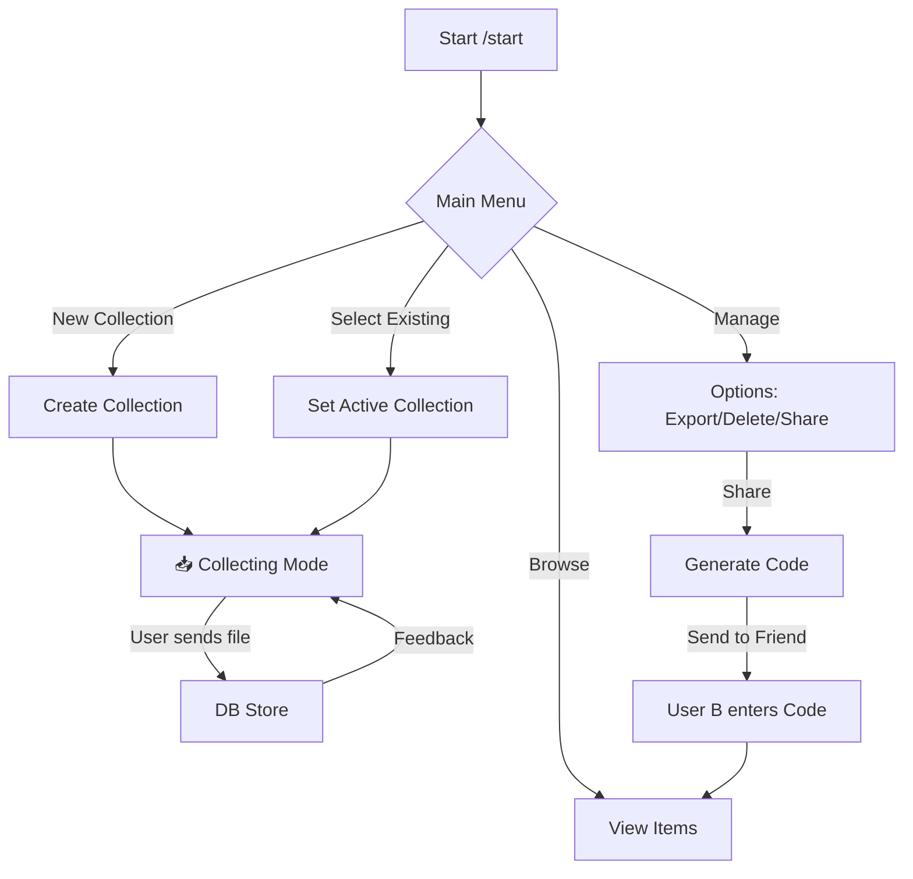

<div align="center">

# 📁 Collections Telegram Bot


**A powerful Telegram bot that helps you store, organize, browse, share, and manage collections of media and text.**

[🇮🇱 עברית](README-he.md) • [🇺🇸 English](README.md)

</div>

---

## ✨ Key Features

| Feature | Description |
|---------|-------------|
| 📦 **Collections** | Create and manage multiple media collections |
| ☁️ **Media Storage** | Store photos, videos, documents, audio, and text |
| 🔍 **Duplicate Scanner** | Identify and remove duplicate files with smart detection |
| 🔗 **Secure Sharing** | Share collections via unique codes with access tracking |
| 📊 **Collection Info** | View detailed stats: item counts by type, sizes, and dates |
| 📈 **Batch Status** | Real-time updates during mass uploads |
| 🛡️ **Admin Panel** | Full user management and analytics dashboard |
| 📝 **Auto-Captions** | Automatically saves captions with media |
| 👁️ **Browsing** | Native Telegram UI for browsing content with scroll view |
| 🎲 **Random Item** | Jump to a random item in your collection with one click |
| ⚡ **Performance** | Asynchronous design with flood protection |

---

## 🚀 Installation

### 1️⃣ Clone the project
```bash
git clone https://github.com/Omer-Dahan/Collections-bot
cd Collections-bot
```

### 2️⃣ Create virtual environment
```bash
# Windows
python -m venv venv
venv\Scripts\activate

# Linux/macOS
python3 -m venv venv
source venv/bin/activate
```

### 3️⃣ Install dependencies
```bash
pip install -r requirements.txt
```

### 4️⃣ Configuration
Create a `config.py` file based on the example below:
```python
BOT_TOKEN = "your_bot_token_here"
ADMIN_IDS = [123456789]  # List of admin Telegram IDs

# Optional custom settings
MAX_CAPTION_LENGTH = 800
```

### 5️⃣ Run the bot
```bash
python bot.py
```

---

## 🤖 Usage

Using the bot is simple and intuitive. Here is the basic workflow:

1.  **Start**: Send `/start` to open the main menu.
2.  **Create Collection**: Select "📁 New Collection", name it, and it will become "active".
3.  **Save Content**: Any message you send to the bot (photo, video, file, text) will be automatically saved to the active collection.
4.  **Manage & Browse**: Use the menus to browse, delete, or share. In single-item view, use the `🎲` button to jump to a random item instantly.
5.  **Collection Info**: In the collection management menu, tap `📊 Collection Info` to view full statistics: video/photo/file counts, size per type, total size, and item dates.

### 🎮 Available Commands

| Command | Description |
|:---|:---|
| `/start` | 🏠 Return to main menu and show status |
| `/new_collection` | 🆕 Create a new collection quickly (e.g. `/new_collection MyTops`) |
| `/list_collections` | 📋 List your collections and select an active one |
| `/browse` | 📂 Browse files stored in your collections |
| `/manage_collections` | ⚙️ Advanced management (Delete, Export, Share) |
| `/remove` | 🗑️ Activate single item deletion mode |
| `/id_file` | 🆔 Get the File ID of a file (Developer tool) |
| `/access` | 🔑 Access a shared collection via code (e.g. `/access CODE123`) |

### 🔄 Workflow



---

## 🧱 Project Structure


```
Collections-bot/
├── 📄 bot.py               # 🧠 Main bot entry point
├── 📄 admin_panel.py       # 🛡️ Admin interface & stats
├── 📄 db.py                # 🗄️ Database operations
├── 📄 utils.py             # 🛠️ Helper functions
├── 📄 config.py            # ⚙️ Configuration (Sensitive)
├── 📂 handlers/            # 🎮 Logic handlers
│   ├── 📄 commands.py      # /start, /help, etc.
│   ├── 📄 callbacks.py     # Button interactions
│   ├── 📄 messages.py      # Media & text handling
│   ├── 📄 browse_handlers.py # Browsing logic
│   └── 📄 duplicate_handlers.py # Duplicate scanner logic
├── 📄 constants.py         # 📝 Constant values
├── 📄 message_tracker.py   # 📨 Message tracking
├── 📄 requirements.txt     # 📦 Dependencies
├── 📄 run_bot.bat          # 🚀 Windows runner
├── 📄 LICENSE.txt          # 📜 GPL-3.0
└── 📄 README.md            # You are here! 👋
```


---

## 🗄️ Database Architecture

The bot uses **SQLite** for efficient local storage.
Tables are automatically created on first run:

- **Collections**: Stores collection metadata
- **Items**: Links media files to collections
- **Users**: User profiles and stats
- **Shared_Collections**: Active share codes and permissions
- **Access_Logs**: Tracks who accessed shared content

---

## 🛡️ Security & Privacy

- 🔒 **Private by Default**: Collections are private unless explicitly shared.
- 🔑 **Unique Codes**: Sharing uses randomly generated unique access codes.
- 🚫 **Access Control**: Owners can revoke share codes at any time.
- 📝 **Logging**: Comprehensive logging of user actions and errors.

---

## ⚠️ Important Notes

> [!IMPORTANT]
> **Telegram Limits**: File uploads are subject to Telegram size limits (up to 2GB per file, or 4GB for Premium subscribers).

> [!WARNING]
> **Data Privacy**: The database (`bot_data.db`) is stored locally. Deleting this file will result in losing all collection data! Regular backups are recommended.

> [!TIP]
> **Efficiency**: The bot stores only the `File ID` of files, not the files themselves, saving significant server storage and ensuring fast performance.

> [!NOTE]
> **Deletion**: Deleting a message from the chat does not remove it from the bot's database. Use the bot's deletion tools to permanently remove items.

---

## 📜 License
This project is licensed under **GNU General Public License v3.0**.

Any redistribution or modification must comply with the terms of this license.

---

## ⚠️ Disclaimer
This bot is intended for lawful use only.
Responsibility for downloaded content and compliance with local laws and platform policies lies solely with the user.

---

<div align="center">

**Made with ❤️ by Omer**

</div>
